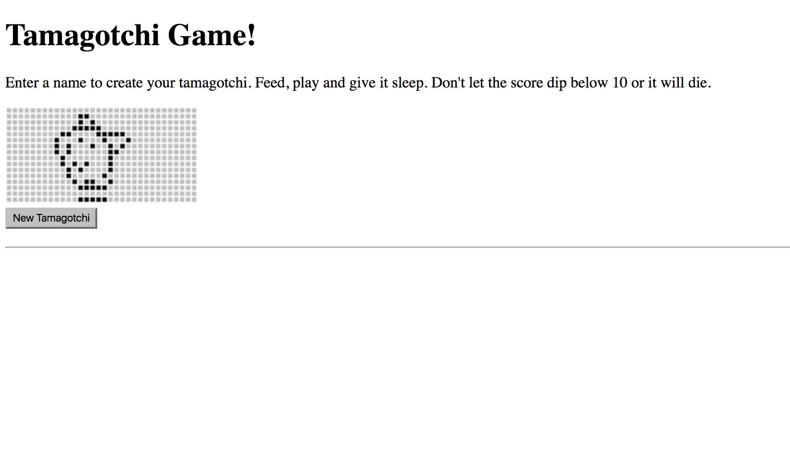
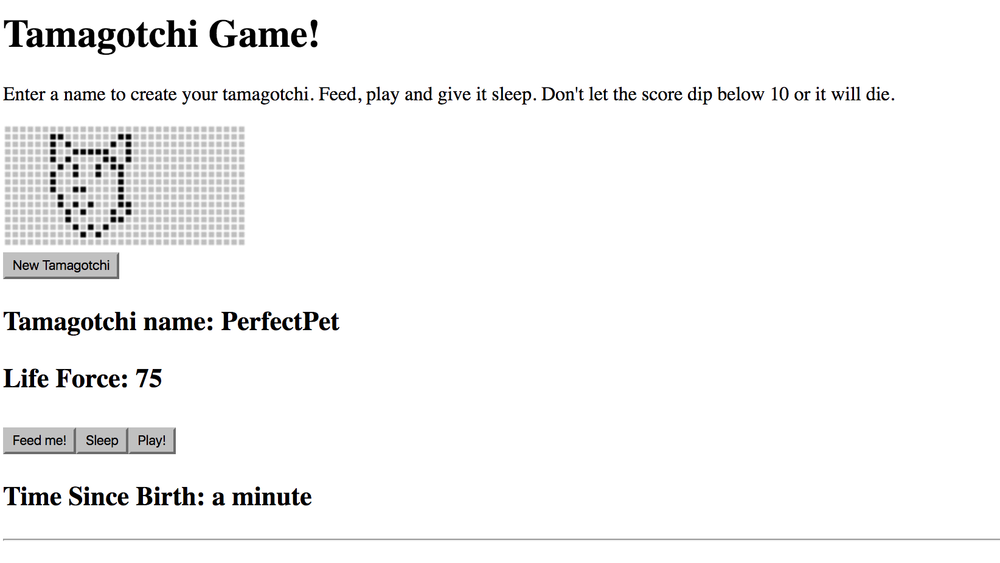
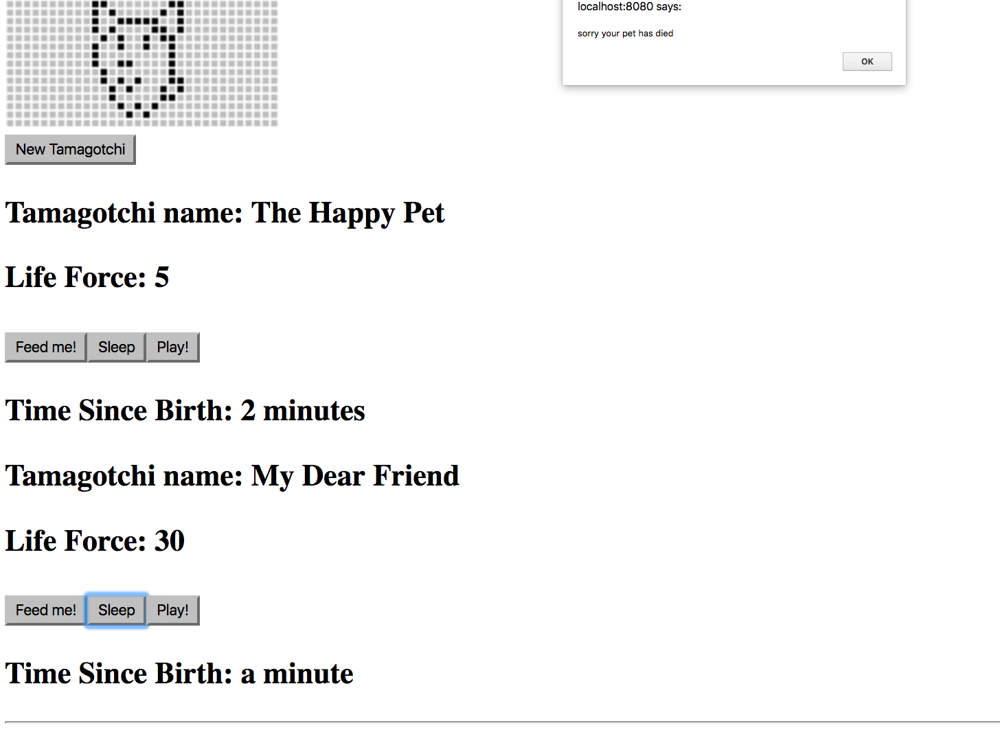

# Tamagotchi Game!

By _Brittany Kerr_ [e-mail me](<mailto:kerrbrittany9@gmail.com>), _Jacob Ruleaux_ [e-mail me](<mailto:jakeruleaux@hotmail.com>), _Michelle Poterek_ [e-mail me](<mailto:poterekm@gmail.com>)

## Description

This web app allows users to play the tamagotchi game. They can create a creature by inputting a name. This starts their 'life cycle', which is reduced by a timer and can increase by feeding, resting and playing with the tamagotchi. But watch out! The creature dies at zero and will disable. Sorry.

Users can enter their pet name and start the game.

Users can play, feed or rest their pet!

The game ends if their pet life finds zero.

## Prerequisites

You will need the following things properly installed on your computer:
* [Node.js](https://nodejs.org/) (with NPM)

## Installation

* Open Github site in your browser and copy: https://github.com/kerrbrittany9/tamagotchi-react
* Open Terminal on your computer and follow these steps:
  * `$ cd desktop`
  * `$ git clone <paste repository-url>`
  * `$ cd tamagotchi-react`
  * `$ npm install`

## Development server

Run `npm start` for a dev server. Navigate to `http://localhost:8080/`. The app will automatically reload if you change any of the source files.

## Known Bugs

Once a user hits zero the component will unmount, thus stopping the timer, but the user can still add points to their dead pet.

## Technologies Used

React.js, JavaScript, Babel, Moment, react-hot-loader, webpack, Node.js, CSS, HTML
